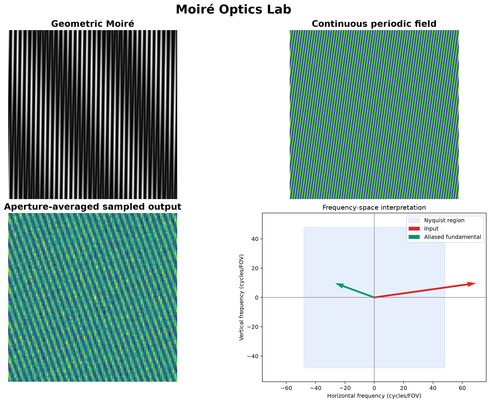

# Moiré Optics Lab

**Moiré Optics Lab** is a bilingual interactive laboratory for exploring
geometric Moiré patterns, spatial-frequency vectors, and sampling aliasing.

The interface runs entirely in the browser. Sliders redraw the canvases on the
next animation frame, so changing a grating period or orientation feels direct
rather than waiting for a server-side rerun.

The optional **3D WebGL view** loads only when opened. It turns the same live
combined pattern into a height-and-color surface, so the Grid 1, Grid 2,
waveform, and combination controls remain the single source of truth.



## What it demonstrates

- **Geometric Moiré:** two line gratings, adjustable periods and relative
  orientation, with a spatial-frequency beat estimate.
- **Sampling and aliasing:** a periodic field can fold into a lower apparent
  frequency when sampled above the Nyquist limit.
- **Two-dimensional reasoning:** a frequency-space view shows the input and
  aliased fundamental vectors against the Nyquist region.
- **Bilingual interaction:** English and Português-BR, including a collapsible
  left navigation rail that keeps the section icons available.

## Classroom use

Start with the sinusoidal waveform, which is now the default for both primary
experiments. It makes the fundamental spatial-frequency relationships easier to
see before introducing the extra harmonics of binary lines. The `?` buttons give
students a concise explanation of each control, and Theory provides a guided
sequence of definitions, formulas, experiments, applications, and cautions.
A prominent page guide beside each section title distinguishes geometric pattern
overlap from sampling and aliasing before students begin changing controls.
Every slider also has a synchronized numeric field for precise values.
The Theory section treats aliasing in a dedicated lesson, including spatial
examples, the time-domain wagon-wheel analogy, and mitigation strategies.

## Run locally

No frontend installation is required. From the repository root:

```bash
python -m http.server 8000
```

Open [http://localhost:8000](http://localhost:8000). A local server is required
for the optional 3D view; it also needs internet access when it first loads
Three.js from its CDN. Stop the local server with `Ctrl+C`.

## A short guided experiment

1. Open **Sampling & aliasing** from the left rail.
2. Keep the grid at `96 × 96` and set the signal frequency to `70 cycles/FOV`.
3. Compare the continuous field, sampled output, and frequency-space view.
4. Move the phase, angle, or grid-density control and observe the response in
   real time.

## Model boundaries

The browser interface is an educational visual model, not a calibrated
measurement tool. The included Python reference model in `moire_physics.py`
contains the detailed numerical routines and unit tests used to document the
underlying relationships.

- The browser visual applies a fast box-blur approximation before sampling.
- The rendered output is an interpolation of discrete sample values; it does
  not add information.
- A binary waveform contains higher harmonics, which can alias even when its
  fundamental is below the stated Nyquist limit.

## Verify the reference model

Requires Python 3.10 or later.

```bash
python -m venv .venv
```

Activate the environment, then install the reference-model dependencies:

```bash
python -m pip install -e ".[dev]"
python -m pytest
```

## Repository layout

```text
moire-optics-lab/
├── index.html             # Browser application
├── app.js                 # Real-time interaction and canvas drawing
├── styles.css             # Responsive navigation and interface design
├── moire_physics.py       # Framework-independent numerical reference model
├── tests/                 # Unit tests for the reference model
├── scripts/               # Reproducible README preview generator
└── .github/workflows/     # Continuous integration
```

## Contributing

Issues and pull requests are welcome. Please keep contributions focused on
clear educational explanations, transparent assumptions, and tests for changes
to the numerical reference model.

## Citation

If this project is useful in teaching material, a demonstration, or a derived
work, please cite it using [`CITATION.cff`](CITATION.cff).

## Development credit

HTML interface developed by Rafael V F Santos, 2026.

## License

Released under the [MIT License](LICENSE).
